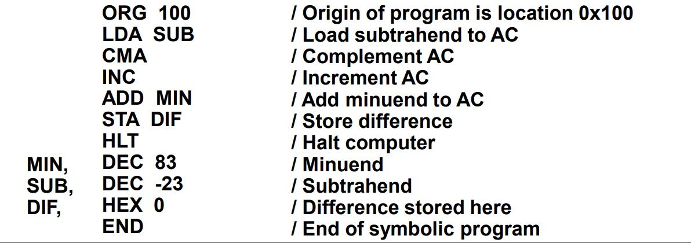

# Introduction 
This is a simple assembler built for the computer organization course.

## Technologies
- Python 
## To test the program:

- Write a program with assembly language with the syntax presented in following screenshot ,without comments, with ".txt" extension.

- Open assembler.py file and pass the path to the file of the program you wrote to the call to assemble function at the end of the file.
- Check the console to know the name of the output file (in the same directory with assembler.py).
- Open the output file (the left block represents the memory location (12 bits) and the right block represents the memory word contents (16 bit) )
- test1.txt and test2.txt have already been provided. Check them out.